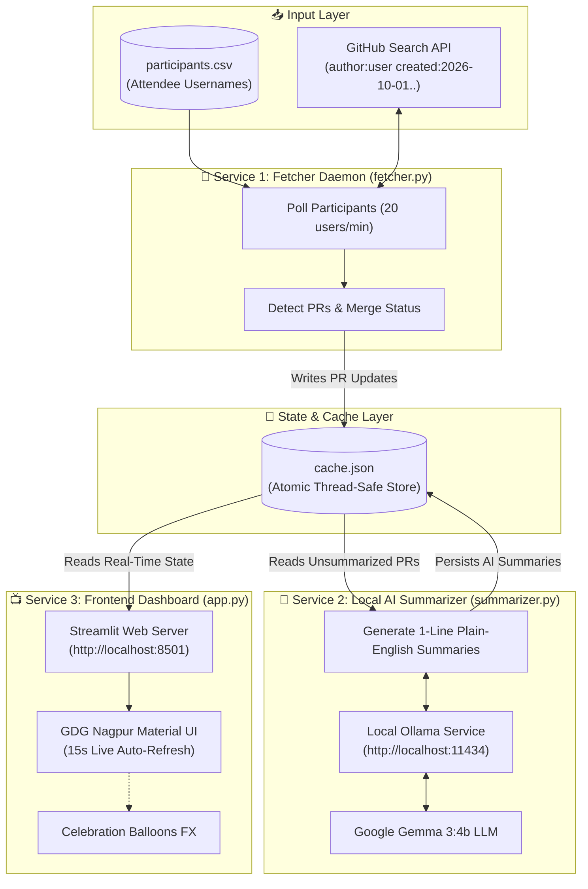

<div align="center">

# 🎃 Hacktoberfest 2026 × GDG Cloud Nagpur
### Live Contributor Showcase & AI Summarizer Dashboard

[](https://gdg.community.dev/gdg-cloud-nagpur/)
[](https://hacktoberfest.com/)
[](https://ai.google.dev/gemma)
[](https://streamlit.io/)
[](https://python.org)

<br/>

**A live, projector-ready dashboard tracking pull requests submitted by attendees of Hacktoberfest 2026 × GDG Cloud Nagpur — with every single contribution summarized into clear, human-readable plain English by Google Gemma 3:4b running locally.**

<br/>

[✨ Features](#-key-features) • [🏛️ Architecture](#-system-architecture) • [🚀 Quick Start](#-quick-start) • [⚙️ Configuration](#-configuration) • [🖥️ Projector Mode](#-projector-mode) • [🤝 Community](#-community--credits)

---

</div>

## 🌟 Overview

During in-person hackathons and contributor showcase segments, audiences usually see confusing GitHub commit titles like `"Fix issue #412"`, `"update index.js"`, or `"typo fix in workflow"`. 

The **GDG Cloud Nagpur Live Dashboard** bridges the gap:
- Attendees register their GitHub username.
- A background worker polls GitHub in real time for pull requests across any repository.
- A local **Google Gemma 3:4b LLM** inspects the diff and title to produce a 1-line, plain-English summary:  
  *👉 "Added responsive mobile navigation controls for the event registration portal."*
- The projector dashboard streams contributions live, updates leaderboards, and fires celebratory balloon effects as soon as a PR merges!

---

## ✨ Key Features

- **🎨 Authentic GDG Cloud Nagpur UI**: Designed strictly following the [Google Developer Groups Nagpur](https://gdg.community.dev/gdg-cloud-nagpur/) design system — featuring Google Sans typography, Google's iconic 4-color palette (Blue, Green, Yellow, Red), Material You cards, and official badges.
- **🤖 100% Local AI Summarization**: Powered by **Google Gemma 3:4b** via Ollama. No expensive third-party cloud API keys, zero rate-limit bans, and private inference running on your local machine.
- **⚡ Live Pull Request Tracking**: Gathers open, merged, and closed PRs with automated status categorization and Hacktoberfest badge tags.
- **🏆 Live Attendee Leaderboard**: Dynamic standings sorted by Merged PRs, then Open PRs, featuring Gold 🥇, Silver 🥈, and Bronze 🥉 podium ranks with GitHub avatars.
- **🎈 Real-time Celebration FX**: Projector triggers animated celebratory balloon bursts the instant any attendee lands a merged pull request.
- **🛡️ Concurrency-Safe & Rate-Limit Resilient**:
  - Configurable GitHub API request throttler (default: 20 users/min) staying comfortably within GitHub's 30/min rate limits.
  - Multi-process lock-free atomic JSON cache with automatic retry fallbacks for Windows and Linux.
- **📺 Projector Ready**: Auto-refreshes every 15 seconds without screen flicker. Designed specifically for wide 1080p and 4K displays.

---

## 🏛️ System Architecture

The project is built on a clean decoupled producer-consumer architecture running three isolated processes:



---

## 📁 Repository Structure

```text
HackDay/
├── app.py                 # Streamlit dashboard styled after GDG Cloud Nagpur
├── config.py              # Centralized environment & settings loader
├── fetcher.py             # Background daemon polling GitHub Search API
├── summarizer.py          # Background daemon running local Gemma 3:4b summaries
├── cache_manager.py       # Atomic, Windows/POSIX thread-safe JSON cache manager
├── participants.py        # Participant loader from local CSV or remote URL
├── participants.csv       # Active attendee usernames & display names
├── .env.example           # Configuration template
├── requirements.txt       # Python dependencies
├── .gitignore             # Git ignore file protecting tokens and sensitive caches
└── README.md              # Project documentation
```
Working


---

## 🚀 Quick Start

### 1. Prerequisites
- **Python**: 3.10 or higher
- **Git** installed
- **Ollama** installed on your system ([Download Ollama](https://ollama.com))

### 2. Pull Local Gemma Model
Start Ollama and pull the official Google Gemma model:
```bash
ollama pull gemma3:4b
```
*(Optionally test it: `ollama run gemma3:4b "Hello GDG Nagpur!"`)*

### 3. Clone & Setup Environment
```bash
git clone https://github.com/SakshamS01/HackDay.git
cd HackDay

# Create virtual environment
python -m venv .venv

# Activate on Windows:
.\.venv\Scripts\Activate.ps1
# Or on Linux/macOS:
source .venv/bin/activate

# Install dependencies
pip install -r requirements.txt
```

### 4. Configure Environment
Copy `.env.example` to `.env`:
```bash
cp .env.example .env
```
Edit `.env` and provide your GitHub Personal Access Token:
```ini
GITHUB_TOKEN=ghp_yourActualGitHubTokenHere
OLLAMA_URL=http://localhost:11434
OLLAMA_MODEL=gemma3:4b
PARTICIPANTS_SOURCE=participants.csv
START_DATE=2026-10-01
END_DATE=2026-10-31
USERS_PER_MINUTE=20
REFRESH_SECONDS=15
```

> **Note on GitHub Token:**  
> A standard personal access token with **public repository read access (default, no scopes checked)** is all that's needed to increase GitHub's API rate limit from 60 to 5,000 requests/hour.

### 5. Launch the 3 Services

Open three separate terminals (or run as background daemons):

#### Terminal 1 — Start the GitHub Fetcher:
```bash
python fetcher.py
```

#### Terminal 2 — Start the Gemma AI Summarizer:
```bash
python summarizer.py
```

#### Terminal 3 — Start the Projector Dashboard:
```bash
streamlit run app.py
```

The live dashboard will automatically open at **`http://localhost:8501`**.

---

## ⚙️ Configuration Reference

| Variable | Default | Description |
| :--- | :--- | :--- |
| `GITHUB_TOKEN` | *Required* | GitHub Personal Access Token for authenticated Search API calls. |
| `OLLAMA_URL` | `http://localhost:11434` | Endpoint of the locally running Ollama server. |
| `OLLAMA_MODEL` | `gemma3:4b` | Gemma model identifier to use for summarization. |
| `PARTICIPANTS_SOURCE` | `participants.csv` | Filepath or Google Sheets published CSV URL containing attendees. |
| `START_DATE` | `2026-10-01` | Start boundary for Hacktoberfest pull requests (`YYYY-MM-DD`). |
| `END_DATE` | `2026-10-31` | End boundary for Hacktoberfest pull requests (`YYYY-MM-DD`). |
| `USERS_PER_MINUTE` | `20` | Throttling rate to prevent hitting GitHub Search rate limits. |
| `REFRESH_SECONDS` | `15` | Polling and hot-reload frequency of the Streamlit dashboard. |

---

## 👥 Adding Attendees

You can add attendees in [`participants.csv`](./participants.csv):

```csv
github_username,display_name
SakshamS01,Saksham Sahoo
vaishnavi22104,Vaishnavi Nandurkar
atharva-werulkar,Atharva Werulkar
nikhil3434,Nikhil Bopche
theboycoder,Aarav Sharma
```

The system automatically extracts usernames even if full URLs like `https://github.com/username` are provided. The fetcher automatically detects additions dynamically without needing a server restart!

---

## 🖥️ Projector Mode

For stage presentations and projector screens:
1. Open Chrome or Edge and navigate to **`http://localhost:8501`**.
2. Press **`F11`** to toggle borderless full-screen mode.
3. The dashboard UI automatically scales typography and card dimensions for maximum visibility across the room.
4. Auto-refresh keeps running silently in the background every 15 seconds.

---

## 🤝 Community & Credits

- **Host Chapter**: [Google Developer Groups (GDG) Cloud Nagpur](https://gdg.community.dev/gdg-cloud-nagpur/)
- **Global Initiative**: [Hacktoberfest 2026](https://hacktoberfest.com/)
- **AI Sponsorship**: [Google Gemma](https://ai.google.dev/gemma)
- **Maintainer**: [@SakshamS01](https://github.com/SakshamS01)

---

<div align="center">
  <sub>Built with ❤️ for the developer community of Central India at GDG Cloud Nagpur.</sub>
</div>
